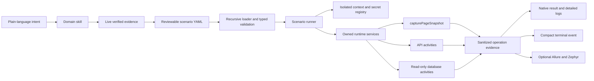

# Plantain Architecture

<!--
DOCUMENT METADATA
- Purpose: Living Python system blueprint
- Last Updated: 2026-09-10
-->

Plantain is a YAML-driven automation runtime for web UI, HTTP API, Swagger/OpenAPI, and
relational-database testing. A tester supplies plain-language intent; an agent discovers only the
evidence it needs, writes reviewable YAML, and runs that YAML through eight generalized internal
activities.

The design removes application-specific screen classes, flow classes, endpoint builders, generated
schema models, and database query builders. Typed YAML is the maintained automation surface.

## Design priorities

1. Security boundaries fail closed.
2. Live discovery replaces guessed UI locators, API contracts, and database identifiers.
3. Scenario state is isolated while expensive transports and pools are shared only by an owning
   run.
4. Inputs, outputs, logs, and persistence are explicitly bounded where completeness is not the
   purpose.
5. Semantic UI capture preserves the complete discoverable layout; chunking provides transport
   bounds without imposing a total-content limit.
6. Internal services remain replaceable without expanding the public activity surface.

## Execution model

Scenario files are selected recursively and deterministically, with traversal and retained-file
ceilings applied before loading. Descriptor-relative no-follow reads and composition-time byte,
node, and depth budgets protect YAML loading. Static `activities` and `validate` commands do not
load dotenv, create runtime directories, or configure logging. Execution resolves `env:NAME`,
random generators, and `${stepId.path}` expressions immediately before each activity. Results
enter only that scenario's context; sanitized operation evidence is retained separately for logs
and reports.

Activity preparation is deduplicated before steps run. UI preparation can provision one browser
binary, while API and database-only runs never initialize Playwright. Browser provisioning
canonicalizes the existing platform temporary root before constructing its private installation
lock, then applies the normal no-symlink and owner-only persistence checks to the appended path.
Finalization attempts every owned cleanup path even when a step has already failed.

One shared admission controller caps scenarios, browser sessions, API requests, database
operations, worker threads, and worker processes. Cancellation retains a permit until its
underlying thread or process exits; killable process workers are terminated and joined first.
Batch execution is explicitly non-reentrant on each runner. Existing time, memory, work, and
connection controls have generous hard maxima without adding configuration.
On Darwin, a worker derives the smallest accepted page-aligned address-space baseline with
immediately restored soft-limit probes, then seals the hard ceiling to that baseline plus the
configured memory budget. Resource-limit setup failures cross IPC as type-only errors rather than
secondary result-channel failures.

## Public activity boundary

| Domain | Activities | Reason for the boundary |
|---|---|---|
| UI | `capturePageSnapshot` | One declarative action/assertion/capture contract replaces screen and flow code. |
| API | `sendRequest`, `loadApiSchema`, `callSchema`, `validateSchema` | Raw HTTP and schema-driven execution remain distinct without endpoint-specific builders. |
| Database | `discoverDatabase`, `queryDatabase`, `verifyDatabaseResult` | Metadata discovery, row retrieval, and assertion are separate read-only concerns. |

Activities are framework-owned internal operations, not plugins. A new application behavior belongs
in YAML unless the existing generic contract cannot express a reusable framework capability.

## Ownership and concurrency

| Resource | Isolation | Owner and close boundary |
|---|---|---|
| Scenario context | Per scenario | Cleared during scenario finalization |
| Secret registry | Per scenario and async task | Cleared after logging/reporting finishes |
| Browser context | Per scenario | Scenario execution services |
| API cookies/session | Per scenario | Scenario execution services |
| Database session/lease | Per scenario operation | Released in `finally` paths |
| Database engines/pools | Shared by one runner or concurrent batch | Disposed once by that owner |
| Reporting HTTP transport | Shared by one runner or batch | Closed once after publication work |
| Dashboard runtime stage | Per project and selected loopback port | Created atomically by the launcher below private `output/`; reused only as Reflex build state |

Directory runs use bounded workers and preserve deterministic result ordering. Pool keys are
credential-safe HMAC identities, so credential rotation creates a new pool without exposing
credentials. Shared services never share scenario values or secret registries.

## Dashboard process and source packaging

`plantain dashboard` is a normal runtime command owned by the installed `plantain` console entry
point. It resolves the same project root and optional dotenv policy as scenario execution, forces
database mutation off, creates the standard private runtime directories, and then invokes Reflex
directly as `sys.executable -m reflex`; it never starts a second Plantain CLI process or scrapes
logs. `--no-dotenv` skips only project-file loading. Existing process environment values remain
available to backend execution, while credentials entered through dashboard Settings remain in
process-owned session stores and never enter browser state or persistent configuration.

The launcher accepts only a validated TCP port and forces production single-port mode with
`127.0.0.1` as the backend host. Before startup it stages a generated `rxconfig.py` and the two
package-owned PNG assets through fail-closed atomic persistence under
`output/dashboard/port-<port>/`. A launcher-owned environment contract supplies the exact project
root and port before Reflex imports its config, so the compiled browser event URL, deployment URL,
CORS origins, and listening server agree without exposing a public bind option.

The GitHub repository is a source distribution. Root `assets/` is the Reflex source-development
mirror; `src/plantain/dashboard/assets/` is the packaged owner used by the launcher. Local artifact
verification requires both mirrors to be byte-identical PNGs, requires only the packaged paths in
the wheel, requires both paths plus `rxconfig.py` in the sdist, and rejects symlinks, executable
members, runtime state, environment files, or missing dashboard-extra metadata. Generated `.web`,
private `output/`, wheels, and sdists are build/runtime products and are not committed.

## Live dashboard execution

The dashboard starts scenarios directly through `ScenarioRunner` and preserves the engine's shared
admission limits, per-scenario isolation, and independent cancellation. Each opaque dashboard job
owns a one-snapshot coalescing channel fed by typed scenario, step, and terminal-operation events;
the channel retains only six recent value-free transitions and disappears with the job handle.
Reflex consumes progress and the final outcome concurrently, so multiple cards advance
independently without polling logs or serializing execution.

Live projections omit targets, inputs, expectations, actual values, response bodies, database
rows, DOM, and exception messages. Full sanitized evidence remains in immutable native results and
is loaded only through the verified run inspector. Observer or rendering failure degrades live
visibility but never changes the test result, while cancellation still reaches the engine-owned
task and its cleanup paths.

## UI discovery and snapshots

`capturePageSnapshot` executes navigation, ordered actions, semantic capture, atomic batch
registration, and ordered assertions. Assertion-bound final evidence registers as diagnostic
before assertions; passing every assertion atomically promotes it to a verified activity alias,
while failure retains the exact diagnostic without claiming the requested state. A failed action
attempts one final diagnostic capture before its original safe error returns. Separate steps
represent meaningful page states while one browser session continues inside the scenario.
Internally, focused lifecycle units own navigation, action/capture, registration, verification,
promotion, and result construction while the YAML-facing activity remains singular.

The local dashboard turns plain-language UI intent into progressive, reviewable discovery without
exposing skill names. The first draft is URL-only; after the user saves and runs it, a passed
integrity-verified semantic snapshot may ground the next interaction or verification. A failed
action or verification may ground one locator-only repair from its exact diagnostic snapshot.
Every generated iteration remains ordinary validated YAML and still requires explicit save and run
actions.

Progressive UI intent stays in a bounded process-owned TTL store behind an opaque identifier. The
identifier is initially bound to the saved scenario, compare-and-rebound when a reviewed
continuation is saved under a new scenario identity, and correlated to each concurrent run result.
Run completion pre-verifies that usable UI evidence exists before the interface presents Continue
discovery or Repair locator; continuation repeats the full report, scenario, registry, manifest,
and artifact integrity proof. Raw DOM, diagnostic content, source paths, and retained intent never
cross into Reflex state.

An action may optionally declare a causal response expectation with an explicit URL glob, method,
status set, and optional timeout. The isolated browser context arms that waiter before the action
and removes it on every outcome; native evidence retains only bounded sanitized URL, method, and
status metadata, never response bodies. Actions without the field follow the existing path and
install no waiter.

The browser context is hardened before its first page:

- Standard mode validates public HTTPS/WSS dependencies and aborts denied subresources or sockets
  without automatically failing unrelated scenario work; denied top-level or popup navigation is
  fatal.
- Restricted mode requires exact host rules and treats every blocked request or socket as a
  scenario policy failure.
- A WebSocket route is installed before page creation; rejected sockets are closed.
- Service workers are blocked so they cannot originate unobserved traffic.
- Browser tracing is off by default because archives can contain sensitive application data.

The extractor streams semantic accessibility and DOM records for the main page and every
discoverable frame through a mutation-detecting cursor. Byte-bounded transfer batches and retained
metadata accounting constrain the configured working set without imposing a total element or frame
limit. A DOM mutation or page/frame topology change aborts that atomic attempt; the activity
rechecks browser policy and retries the complete extraction at most three times. Exhausted
consistency retries and record, metadata, or total-storage envelope failures register nothing.
Content-addressed chunks have SHA-256 descriptors and are verified before registration. Network
lifecycle events are stored as per-capture cursor deltas with bounded unfinished-request
correlation and no request or response bodies.

Locator ambiguity is evaluated across the complete Playwright match set using native visibility
filtering rather than a first-N Python scan. Locator frame paths have no separate fixed depth cap,
and action/assertion lists rely on the YAML document budgets and scenario deadline instead of a
duplicated public count limit.

Registry v4 uses a top-level `entries` array. Each structural-state entry separates verified
aliases under `activities` from failed-intent records under `diagnostics`; diagnostics resolve only
by exact filename. Runtime resolution holds the process-shared registry lock while requiring
registry schema 4.0, complete manifest schema 3.0, matching entry metadata, contained non-symlink
paths, exact byte counts, and matching SHA-256 digests. Earlier registry shapes are rejected and
must be regenerated through discovery rather than migrated or reused.

Registration and promotion are transactions over a frozen baseline. They handle page identity,
structural states, aliases, cross-build normalization, history, deprecated redirects, rollback,
and private-stage cleanup. History allocation adds a deterministic suffix when timestamps collide,
so supported concurrent processes never silently overwrite prior evidence. Agents never edit the
registry or evidence files directly. Cancellation is checked around staged mutations and both
sides of atomic registry writes. The registry and promoted manifest participate in the mutation
journal, and callers await rollback and private-stage cleanup before returning.

## API execution

The API client is asynchronous and explicitly bounds connections and redirect count while sharing
one wall-clock timeout and one response-byte budget across the complete retry/redirect chain.
Every redirect is revalidated, cross-origin requests retain only a conservative safe-header
allowlist, and HTTPS-to-HTTP downgrade is rejected. Request JSON and decoded response JSON reject
non-finite numbers; decoded JSON also has generous internal depth and item ceilings.

Swagger 2 and OpenAPI 3 documents are interpreted at runtime. Valid documents are cached by content
hash with a bounded, atomically maintained source index. Every cache load recomputes the digest and
revalidates size, shape, version, local references, and unambiguous source identity. Schema-download
headers and operation headers are separate: protected schema fetches do not participate in public
conditional-cache reuse. Cache documents and project-relative API body files are read through
descriptor-relative no-follow traversal, closing path-check/read race windows.

OpenAPI document and JSON Schema conformance validation run in short-lived spawned processes with
parent-enforced wall time plus OS CPU and address-space ceilings. Child environments are cleared,
unexpected failures return only their exception type, and unavailable OS limits fail closed.
Swagger 2 and OpenAPI 3.0 use legacy Draft 4-compatible semantics; OpenAPI 3.1 uses Draft 2020-12.

`callSchema` selects an operation, validates its request when enabled, sends it through the same
guarded client, and validates the response when enabled. `validateSchema` supports a separate
expected-invalid assertion for known contract drift. Complete response data stays in isolated
scenario context for chaining, including the observed response media type; only bounded
recursively sanitized previews enter logs. Failures
before normal API operation tracking retain one minimal sanitized preparation record.
An optional process-level API method allowlist is permissive when unset and requires no YAML
changes; configured organizations can restrict application request methods before dispatch.

The first server declared by a validated OpenAPI contract is selected deterministically, with
server variables resolved only from declared defaults. The resulting target still passes URL and
DNS policy, so ordinary contracts need no duplicate server setting; non-default server override
remains an optional future enhancement.

Unsupported contract features fail closed. Current intentional limits include external `$ref`
documents, multipart/form-data and cookie parameters, response-header validation,
callbacks/webhooks, automatic non-default server selection, server variable synthesis, and
serialization styles the runtime cannot prove correct.

## Database execution

Database URLs accept the four familiar JDBC-form inputs for compatibility, then translate them to
SQLAlchemy URLs with native Python drivers:

- PostgreSQL: `psycopg`
- SQL Server: `pyodbc`
- MySQL: `mysql-connector-python`
- Oracle: `oracledb`

SQLAlchemy `QueuePool` supplies bounded pooling, pre-ping, timeout, recycle, and rollback-on-return.
Individual settings and one internal aggregate connection ceiling bound total configured pool
capacity without adding another user setting. TLS defaults are vendor-aware and fail closed when a
configuration weakens identity verification without an explicit reviewed opt-in.
Per-source creation reservations count against that same ceiling. Identical sources share one
in-flight engine creation, while unrelated sources initialize concurrently instead of holding the
manager lock across driver setup; manager shutdown waits for every reserved creation to install or
clean up.

Every pool acquisition revalidates the exact host/port and current DNS answers. Agent sessions apply
vendor read-only transaction controls and statement/driver timeouts where supported; the deployment
account remains least privilege because SQL Server and database parsers are not authorization
systems. Cancellation or timeout quarantines uncertain work and retires its engine after the worker
releases the final lease rather than reusing possibly poisoned state.

`discoverDatabase` uses three phases: schemas, tables, and one complete table/view. Supported
vendors page and filter catalog names server-side with bound SQLAlchemy Core expressions; an
unsupported catalog query quietly falls back to Inspector/reflection. Neither path scans
application rows or adds user configuration. Once identifiers and dialect are known,
`queryDatabase` accepts exactly one explicitly parameterized read-only statement, validates
named binds, and applies a SQL AST plus execution firewall. Project-relative SQL files are opened
below `sql/` through descriptor-bound no-follow reads. `verifyDatabaseResult` understands scalar
value, one row, and multiple-row evidence and rejects truncated envelopes when completeness is
required. Uniform unordered partial rows use linear projected-multiset counts; heterogeneous shapes
use a work-bounded non-recursive augmenting matcher. Chaining `${query}` retains the complete
envelope; `${query.result}` deliberately selects
only its data for consumers that do not need completeness metadata. Query execution quietly adds a
vendor-correct root row cap when absent, requests batched cursors, and enforces an aggregate
serialized result budget. Server timeouts bound computation; DBAPI drivers may still materialize
scalar cells before returning them, while sized streamable LOBs are rejected before reading when
they cannot fit.

The human-only mutation CLI is physically separate from activity registration. It requires a
process gate, exact acknowledgement, one contained reviewed file, and `NullPool`. Agent skills and
scenario YAML have no route to it.

## Security and data handling

One recursive redaction policy protects console messages, JSONL diagnostics, operation evidence,
native results, Allure data, Zephyr attachments, and terminal events. It combines:

- built-in credential-shaped field names and unstructured credential patterns;
- configured fragments from `sensitive-keys.txt`, including fragments embedded in free-form text;
- values observed while resolving environment-backed scenario data whose variable names are
  classified by built-in or user-configured sensitive-key policy.

Raw context is available only inside its scenario. Sanitized evidence is produced before it enters
reporting collections. Artifact sanitization is complete; diagnostic rendering additionally applies
depth, collection, text, and byte bounds. Excessively nested artifact structures fail explicitly
rather than being partially persisted or exhausting the Python call stack.
Environment and expression strings, context paths, and each scenario's observed-secret registry
have generous internal ceilings. Classified secrets shorter than four characters are masked only
when whole or delimiter-bounded, avoiding destructive replacement inside normal words.

Outbound URL validation separates HTTP and WebSocket schemes while sharing deny rules, DNS
resolution, public-address checks, and a hard-bounded TTL cache. Standard mode permits public
HTTPS/WSS without requiring users to enumerate every application dependency. Restricted mode adds
exact host rules and deployment egress attestation. Private targets require an exact allow rule
plus private-network opt-in; insecure traffic is limited to explicitly enabled loopback local
development. Database connections use a separate exact `host:port` allowlist and fresh DNS
validation before every pool acquisition.

Application-level DNS validation cannot pin the peer subsequently selected by Playwright, HTTPX,
or native database drivers. Restricted non-local URL policy, Zephyr publication, and non-local
database access therefore require an external egress firewall/proxy and attest that control with
`PLANTAIN_EGRESS_CONTROL_ENFORCED=true`; the setting does not install or substitute for the
external control. Operators requiring peer-level enforcement for public application traffic
should use restricted mode behind that deployment control.

## Persistence and reporting

Owner-only local persistence supports Linux and macOS, including Linux under WSL2 or a container.
Native Windows ACLs are not yet a supported backend and fail explicitly. POSIX paths must be owned
by the current user, contain no symbolic-link component, and verify as mode `0700` for directories
or `0600` for files; incompatible mounted filesystems fail rather than weakening these guarantees.

Redaction is not de-identification. Evidence uses three handling classes:

- **Sensitive local:** detailed logs, native and Allure results, snapshots and their registry,
  browser traces, temporary telemetry, locks, and the token-free Zephyr outbox.
- **External minimized:** an ordinary Zephyr result and a terminal event if an operator forwards
  the local Splunk-ready stream. These omit payload evidence but may retain business metadata.
- **External sensitive, explicitly approved:** complete report attachments or any operator/agent
  export of snapshots, traces, logs, Allure data, or native results.

The runtime never silently sends an entire repository, trace, log, or native result file to an AI
provider. Dashboard agent workflows locally filter attached sources and derive bounded,
test-relevant excerpts; verified semantic snapshot excerpts may also ground UI planning and
authoring. A local provider keeps that exchange local. A hosted provider requires the dashboard's
one-time content-transfer disclosure before selected content is sent, and operator export remains
a separate deployment decision. None of these paths make evidence de-identified.

| Evidence | Default lifecycle and bounds |
|---|---|
| Browser network spool and snapshot staging | Scenario/activity lifetime; closed or aborted after use and bounded by the configured capture envelope. |
| Browser trace archives | Off by default; when approved, encrypted-storage attestation is required and retention defaults to 7 days, 20 archives, and 1 GiB. |
| Terminal event stream | 100 MiB rotation threshold with seven retained backups; individual events are bounded and payload-free. |
| Zephyr outbox | Default 1,000-entry cap, hard 100,000-entry configuration cap, and 128 KiB per document; ambiguous delivery remains until manual reconciliation. |
| Canonical snapshots and registry | Project lifetime and a configurable per-capture byte envelope, default 512 MiB; no silent age/count deletion that could invalidate locator grounding. |
| Detailed logs, native results, and raw Allure results | Workspace/job lifetime; no silent framework age/count/aggregate pruning. CI should use ephemeral workspaces and persistent deployments must supply an organizational maximum. |

Owner-only modes do not provide encryption. Workspaces that may hold PII, PHI, or payment-related
evidence require encrypted storage; transient evidence should be excluded from backups, and any
approved canonical backup inherits the same access and retention policy. POSIX permissions cannot
audit successful reads, so regulated deployments use operating-system, EDR, CI-runner, or storage
audit facilities.

Framework cleanup verifies targets and durably unlinks names, but it does not claim physical
overwrite on SSD, copy-on-write, journaled, or backed-up storage. Where erasure guarantees are
required, deployments use encrypted volumes and cryptographic key destruction while expiring
backups under the same policy.

Framework persistence writes a private sibling temporary file, flushes and synchronizes it,
atomically replaces the target, and synchronizes the parent directory. Cleanup failures are
reported with the primary failure. Unsupported mounted/runtime filesystems fail rather than
silently falling back to in-place persistence. If parent-directory synchronization fails after
replacement, callers receive `AtomicCommitUncertainError`: the target may already contain the new
document, so retry or rollback requires reconciliation rather than assuming no commit occurred.

The runner determines scenario outcome and owned-resource cleanup before materializing optional and
required projections. Each execution writes one immutable sanitized native result under
`output/results/<scenario-source>/<correlation-id>.result.json`; that result is canonical. Zephyr
and Allure derive from the same authoritative state, and their integration outcomes are included
in subsequent local projections.

Reporting has three different failure contracts:

- Native scenario-result and required terminal-event persistence are framework integrity
  requirements and fail closed.
- Detailed per-command JSONL diagnostics use distinct per-process files. A write failure emits one
  fixed value-free console error without replacing the authoritative scenario outcome.
- Optional Allure raw-result emission records its integration failure without changing the test
  outcome.
- Optional Zephyr Scale Server/Data Center publication and attachment failures are retained as
  sanitized integration results without replacing the scenario outcome.

Enabled Zephyr publication first atomically enqueues a token-free intent and then grants one
cross-process claimant permission to send it. Confirmed pre-send failures return to `queued`;
delivery-ambiguous jobs remain non-retryable pending manual reconciliation, while confirmed
successes and HTTP rejections become terminal. After the current result succeeds, a bounded
oldest-first drain replays queued results with the current credential and URL policy. Attachments
remain optional current-run projections and are never replayed.

Detailed timestamped JSONL logs preserve sanitized operation traceability. The rolling Splunk file
contains one low-cardinality `scenario.completed` event per scenario and deliberately excludes
payload evidence.

## Evolution rules

- Extend declarative models before adding a public activity.
- Preserve the public eight-activity surface unless a cross-application capability is impossible to
  express safely.
- Keep shared resources bounded and give each one an explicit owner.
- Add limits to transports and diagnostics, not to evidence whose purpose is complete discovery.
- Update the activity contract, examples, architecture, scoped agent instructions, and tests in the
  same change whenever behavior changes.
- Prefer current contracts, executable examples, and measured runtime behavior over historical
  assumptions or inferred conventions.
