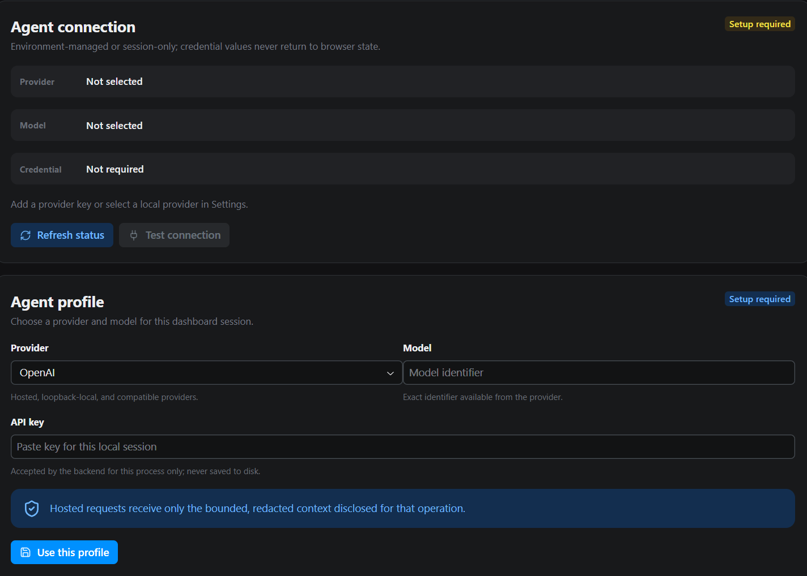

# Connect the agent

Plantain’s agent turns plain-language intent and selected evidence into a
reviewable test plan and generated scenario. Connect one provider before using the
**Create** workspace.

The test runtime itself remains local. A hosted provider receives only the bounded,
sanitized context selected for the active agent operation.

## Choose a provider

Plantain supports:

| Provider | Credential | Connection |
| --- | --- | --- |
| OpenAI | `OPENAI_API_KEY` | Hosted |
| Anthropic | `ANTHROPIC_API_KEY` | Hosted |
| DeepSeek | `DEEPSEEK_API_KEY` | Hosted |
| Gemini | `GOOGLE_API_KEY` or `GEMINI_API_KEY` | Hosted |
| Ollama | Not required | Local at `http://127.0.0.1:11434/v1` |
| LM Studio | Not required | Local at `http://127.0.0.1:1234/v1` |
| Custom compatible endpoint | Optional `PLANTAIN_AGENT_API_KEY` | HTTP or HTTPS origin you provide |

Choose a provider approved for the data and environment involved in your tests.
Plantain does not decide your organization’s data-governance policy.

## Configure through Settings

Open **Settings**, then use the **Agent** section:

1. choose the provider;
2. enter the provider’s model identifier;
3. enter a credential when the provider requires one;
4. for a custom provider, enter its compatible endpoint;
5. save the session configuration;
6. confirm that the connection status is ready.



*Before setup is complete, Settings identifies the missing profile without
returning a credential value to browser status.*

Hosted provider names and model choices are non-secret. Treat the credential as a
secret even though it is entered into a password-style field.

## Understand session credentials

A credential entered in **Settings**:

- is retained only in backend process memory;
- is not returned to the browser after submission;
- is not written to project settings, generated tests, or result files;
- remains available until you clear the session profile or stop the dashboard;
- overrides the matching environment value only for agent operations.

Leaving the credential field empty while updating the same provider retains the
current session credential. Clear the agent session when you want Plantain to
return to environment discovery.

## Configure through the environment

Before starting the dashboard, make the matching provider credential available
through your shell or approved secret-injection system. For OpenAI, the process
must already have `OPENAI_API_KEY`; then launch with the non-secret provider and
model choices:

```bash
PLANTAIN_AGENT_PROVIDER="openai" \
PLANTAIN_AGENT_MODEL="your-approved-model" \
uv run --locked --all-extras plantain --no-dotenv dashboard
```

Replace the example model with the approved identifier. Never place the resolved
credential in documentation, a committed script, or the command itself.

When no provider is selected, Plantain automatically detects a hosted provider
only when exactly one supported hosted credential is present:

- one detected provider — Plantain can select it;
- more than one — **Settings** asks you to choose;
- none — **Settings** asks you to add a key or select a local provider.

A model identifier is still required.

## Use a local provider

Choose **Ollama** or **LM Studio** when the compatible service is already running
on the documented loopback endpoint. Then provide the exact model identifier
available in that local service.

Local providers do not require an API key by default. They still receive the
selected task context, so apply the same review discipline you use for a hosted
provider.

Plantain does not install, start, or manage the local model service.

## Use a custom compatible endpoint

Choose **Custom compatible endpoint** for an OpenAI-compatible service.

The endpoint must:

- use `http` or `https`;
- include a hostname;
- omit embedded usernames and passwords;
- omit query parameters and fragments;
- identify only the API origin or compatible base path.

Enter a credential only when that service requires one. Do not place credentials
inside the endpoint URL.

## What provider status means

| Status | Meaning |
| --- | --- |
| Ready | Provider, model, endpoint, and required credential are available |
| Setup required | One or more required fields are missing |
| Choice required | Several hosted credentials were detected and you must select one |

The browser receives provider name, model, endpoint, readiness, and credential
source—not the credential value.

## Protect agent context

Before submitting an intent:

- remove literal secrets from the request;
- select only context relevant to the current goal;
- avoid unnecessary personal or regulated data;
- review semantic UI, API, or database evidence before sharing it;
- use a local provider when policy prohibits external processing.

Plantain applies redaction and bounded context selection, but those controls do not
replace your organization’s approval requirements.

## If the agent is not ready

- Confirm that a provider and valid model identifier are selected.
- Confirm that a hosted provider key is available from the chosen source.
- For a local provider, confirm the service and model are running.
- For a custom provider, remove credentials, queries, and fragments from the URL.
- If multiple hosted keys are present, choose the intended provider explicitly.
- Clear the session profile and reconfigure it if the credential source is stale.

Then return to [Create your first test](../get-started/first-test.md).
