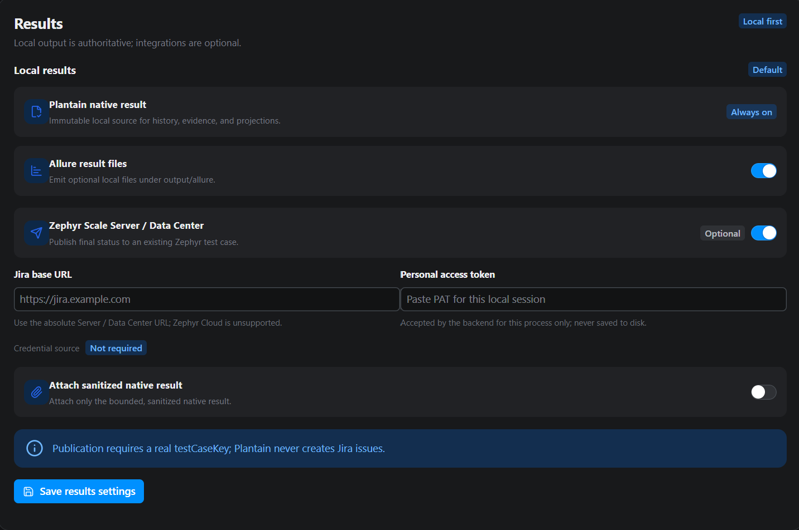

# Configure results

Plantain always creates an authoritative local result first. In **Settings**, the
**Results** section controls that default result behavior and the optional
destinations that may receive selected output.

You do not need an integration to run tests or use **Runs and Results**.

## Start with local results

Every accepted execution can produce:

- an immutable native result;
- detailed sanitized JSONL operation evidence;
- a compact terminal summary;
- a compact Splunk-compatible terminal event;
- supported semantic or reporting artifacts.

These remain under the project’s ignored `output/` structure. The dashboard reads
bounded projections of this local evidence rather than making an external
integration the source of truth.

## Open the Results settings

Go to **Settings** and find **Results**.

The default local-results area appears first. Optional integration subsections
appear within the same result configuration:

- **Allure** for local raw Allure result files;
- **Zephyr** for optional Zephyr Scale Server or Data Center publishing.

Enable only the destination your workflow needs.



*Local results remain always on; each additional destination is an explicit,
separate choice.*

## Allure results

Enable Allure when another approved tool or CI job will consume Plantain’s raw
Allure files.

Plantain writes dependency-free raw results under:

```text
output/allure/
```

Plantain does not install or run the separate Allure command-line report generator.
Generating and hosting Allure HTML remains an explicit human or CI operation.

Allure enablement does not change the native local result.

Environment equivalent:

```text
PLANTAIN_ALLURE_RESULTS_ENABLED=true
```

## Zephyr publishing

Plantain supports Zephyr Scale for Jira Server and Data Center. Zephyr Scale Cloud
uses a different API and is not supported by this integration.

To configure a dashboard session:

1. enable Zephyr result publishing;
2. enter the Jira origin or context-root URL;
3. provide a Jira personal access token;
4. decide whether native-report attachment is necessary;
5. if attaching, explicitly confirm data-governance approval;
6. save and review the readiness status.

Use a base URL such as:

```text
https://jira.example.com
```

or:

```text
https://jira.example.com/jira
```

Do not append the Zephyr REST path, credentials, a query, or a fragment.

## Understand Zephyr identifiers

Plantain preserves identifiers already present in the generated scenario:

- `testCaseKey` identifies the existing Zephyr test case and is required for
  publication;
- `testRunKey` identifies an existing test cycle and is optional;
- `JiraTicket` identifies a linked issue when one was supplied;
- `JiraTicket: N/A` means no issue is linked.

Plantain does not fabricate test-case or test-run keys. A local test without a real
`testCaseKey` still runs and retains its local result, but it cannot be published
as a Zephyr execution.

## Attach reports only when approved

Zephyr publishing and full native-report attachment are separate choices.

Attachments can contain sensitive business evidence even after sanitization.
Enable attachment only when:

- the destination is approved for that data;
- attachment governance has been reviewed;
- the configured size limit is appropriate;
- the underlying Jira access and retention policy are understood.

Both the attachment option and the governance approval must be enabled. A checkbox
does not create organizational approval.

## Credential sources

The Jira personal access token can come from:

- `JIRA_PERSONAL_ACCESS_TOKEN` in the process environment; or
- the active dashboard result session.

A token entered in **Settings** stays in backend process memory. It is not written
to the scenario, result, outbox, or project settings. Stopping the dashboard
discards it.

The non-secret endpoint and enablement choices may also come from environment
settings documented in `.env.example`.

## Publication order

Local persistence happens before optional publication.

If Zephyr is unavailable:

- the native result remains authoritative;
- a publication error does not turn a passing test into a missing local result;
- eligible work can enter the bounded, durable, token-free outbox;
- the dashboard result summary distinguishes execution from integration status.

Outbox entries never store the personal access token.

## Splunk-compatible terminal events

Plantain writes compact terminal telemetry to:

```text
output/event/splunk-event-json.log
```

This is a local event file, not a built-in outbound Splunk connection. An approved
collector may ingest it using your deployment’s normal controls.

The terminal event stays compact. Detailed operation evidence remains in the
native result and JSONL outputs.

## Private Zephyr destinations

A private Jira host requires:

- explicit Zephyr private-network opt-in;
- exact destination approval;
- real deployment egress enforcement where required;
- reviewed TLS behavior.

HTTPS is required unless a human explicitly enables the limited insecure-HTTP
exception. See [Network access](network.md) before configuring a private
destination.

## What to review

Before saving result settings, confirm:

- local results remain enabled as your source of truth;
- each optional destination has a clear consumer;
- the credential source is appropriate;
- attachment is disabled unless genuinely required;
- the endpoint identifies the intended Jira deployment;
- required Zephyr identifiers already exist;
- no destination receives more evidence than it needs.

After a run, use [Runs and Results](../testing/results.md) to review execution and
publication status separately.
