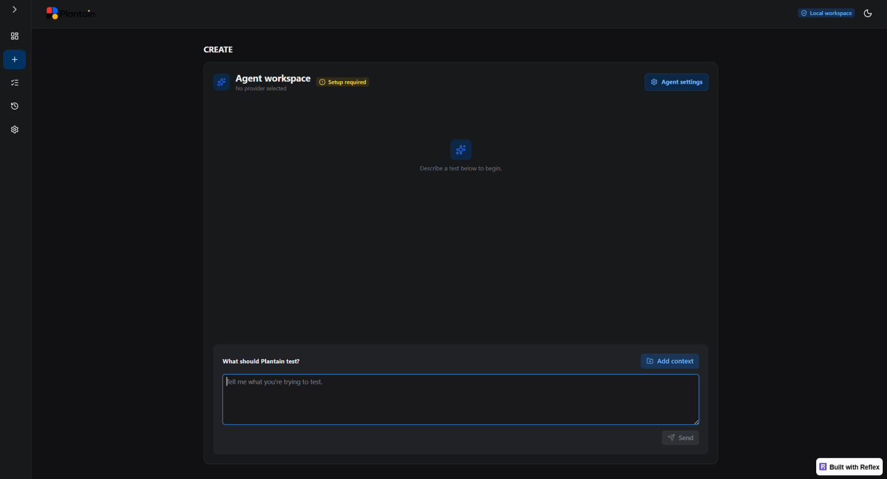

# Describe an effective test intent

Plantain works best when you describe the behavior that deserves confidence and the
result that would prove it. You do not need to translate that goal into test code,
page selectors, HTTP requests, or SQL.

## Agent workspace

The **Create** page is Plantain’s Agent IDE. Describe what you want to test and add relevant context when needed. The agent uses that context to clarify your intent, create a grounded test, run it, and show progress in the workspace.

*The Agent workspace keeps planning, test creation, and live execution together so you can review the agent’s progress and results in one place.*

## Start with the outcome

A useful intent answers three questions:

1. **What should happen?**
2. **Where should it happen?**
3. **What observable result proves success?**

Use this sentence pattern when you are unsure where to begin:

> Confirm that **[person or system]** can **[important behavior]** in
> **[approved target or environment]**, and verify **[observable result]**.

For example:

> Confirm that a standard customer can complete checkout in the demo storefront,
> and verify that the order confirmation appears.

This tells Plantain what matters while leaving discovery and automation mechanics
to the agent.

## Add the boundary that matters

Include a boundary when it changes the business meaning of the test:

- user role or account type;
- product, state, or record category;
- positive, negative, or boundary outcome;
- required API operation or documented contract;
- read-only database fact;
- relationship between two systems.

Avoid adding implementation details merely to make the request sound technical.
Plantain should derive current interface controls, supported API parameters, and
database structure from evidence.

## Examples by testing goal

### UI journey

> Verify that a locked-out user cannot sign in and sees the expected explanation.

### API contract

> Using the approved Petstore OpenAPI schema, verify that available pets are
> returned successfully and match the documented response contract.

### Database fact

> Verify that the most recently created UNO clothing item exists and return only
> the fields needed to identify it.

### Cross-system outcome

> Confirm that an order submitted in the browser is accepted by the API and can be
> found in the database without changing database state.

### Focused continuation

> Keep the approved sign-in path, then add the checkout behavior and verify the
> completion message.

The last example tells Plantain to preserve prior grounded work rather than
recreate the entire journey.

## Refer to protected values safely

Name the environment reference; do not paste its value:

> Use `SAUCE_DEMO_URL`, `SAUCE_DEMO_USERNAME`, and
> `SAUCE_DEMO_PASSWORD` from the runtime environment.

This gives the agent enough information to create safe references while keeping
resolved values out of the generated scenario.

Never enter a real password, token, connection string, private key, or session
cookie in:

- the intent;
- optional context notes;
- test names;
- tags;
- paths;
- reporting identifiers.

## Add context with purpose

Open **Add context** only when a source will materially improve the result. Useful
context includes a selected existing test, a prior run, an approved API schema, or
current discovery evidence.

More context is not automatically better. A focused selection makes the agent’s
reasoning easier to review and reduces unnecessary disclosure to an external
provider.

## Expect clarification when meaning is ambiguous

Plantain may ask which outcome you mean when the choice would change the test. For
example:

- Should checkout stop after payment is accepted or continue to the confirmation?
- Should an API response be checked only for status or against the full schema?
- Which environment reference identifies the database source?
- Should an existing test be extended or should a separate test be created?

Answer in product language. You do not need to propose the implementation.

## Review the plan, not the prose

Before accepting a plan, confirm that it:

- proves the requested outcome;
- starts from the right state;
- includes the meaningful boundary;
- uses only approved targets and context;
- has a clear final verification;
- remains small enough to diagnose when it fails.

A polished description is not useful if the proposed checks do not prove the
behavior.

## Improve a result with one focused correction

When a proposal is close, state what must remain and what must change:

> Preserve the existing inventory request. Change the final check so it verifies
> both the response schema and that at least one available pet is returned.

This is clearer than starting over or describing internal test syntax.

Next, choose the relevant workflow:
[UI](ui.md), [API](api.md), [database](database.md), or
[cross-system](cross-system.md).
