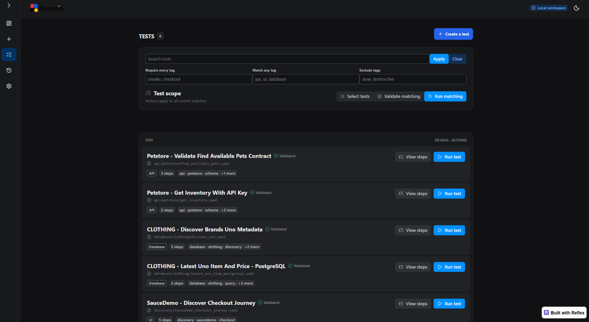
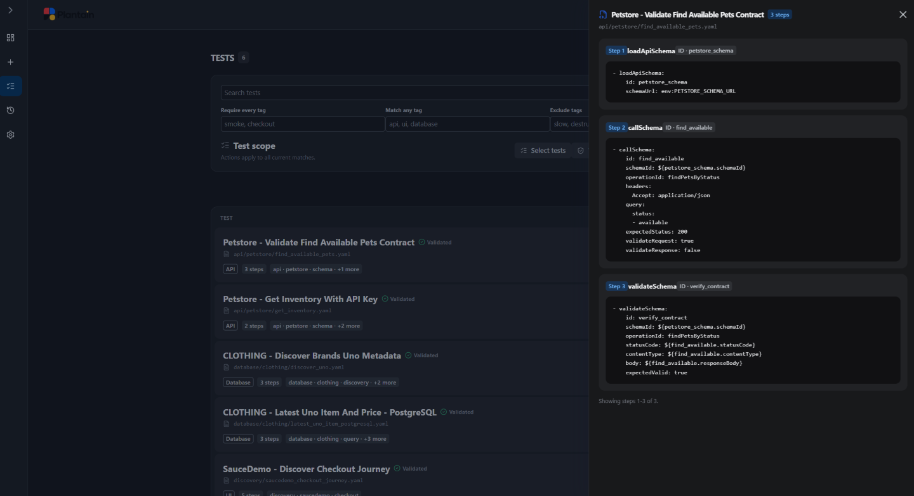

# Manage tests

The **Tests** page is the catalog of test cases Plantain can validate and run in
the current project. It is designed for finding, reviewing, and selecting tests;
use **Create** when you want the agent to create or revise behavior.

*The catalog keeps filtering and batch scope above the table while each normal row
retains only View steps and Run test.*

## Read a test row

Each row answers the questions you need before running:

- **Name** — the behavior the test is intended to prove;
- **Source** — where the generated scenario is stored in the project;
- **Readiness** — whether Plantain can load and validate the test definition;
- **Type** — the main system involved, such as UI, API, or database;
- **Step count** — the number of ordered actions and checks;
- **Tags** — optional labels used to organize and filter the catalog.

A readiness indicator describes the test artifact, not the latest execution.
Open **Runs and Results** to see whether a test passed or failed when it ran.

## Find the right tests

Use **Search tests** to narrow the catalog by recognizable test identity. Use the
tag fields to:

- require every listed tag;
- accept any one of several tags;
- exclude unwanted tags.

Filters apply to the complete catalog, not only the visible page. Pagination keeps
large workspaces responsive without changing which tests match.

Clear or adjust filters when an expected test is missing. A test may also be shown
as invalid when Plantain discovered its file but could not load it safely.

## Review what the agent created

Select **View steps** on a test row to open its detail drawer.

*The drawer presents one sanitized action or check at a time while preserving the
test table underneath.*

A step is one action or check in the test case. Reading the ordered steps helps you
understand:

- what Plantain will interact with;
- which evidence each step produces;
- what condition each verification checks;
- how an earlier result is used later;
- whether the sequence still matches the business intent.

You are auditing agent behavior, not learning how to author YAML.

## Interpret the generated step view

The drawer presents a bounded, sanitized view of each generated step.

| What you see | What it means |
| --- | --- |
| Position | When the action or check runs |
| Activity name | The kind of interaction Plantain will perform |
| Step ID | A stable name Plantain can use when a later step needs this result |
| Indented YAML preview | The generated settings for this one action or check |
| `env:NAME` | Plantain will obtain the value from the runtime environment |
| A reference to an earlier step | Plantain will reuse a bounded value produced inside this test |
| Redacted text | A protected value was removed from the review surface |
| Limited-content notice | The full step exists, but the drawer reached its safe display limit |

For example, an API test may show one step that loads the approved schema, another
that calls a documented operation, and a final step that validates the response.
A database test may show discovery, one read-only query, and verification.

The drawer can paginate long tests. Display limits do not change the saved test or
what executes.

## What to check before running

Ask:

- Does the ordered behavior match the test name?
- Is the final step strong enough to prove the outcome?
- Are the target and credential values represented by environment names?
- Does each system interaction contribute useful evidence?
- Is database access read-only and narrowly scoped?
- Are there surprising actions, fields, or destinations?

If the answer is unclear, return to **Create** and describe the correction in
business language.

## Work with one test

From a normal row:

- **Run test** starts the execution flow for that test;
- **View steps** opens the audit drawer.

The row does not need a permanent selection button. Selection controls appear only
when you intentionally enter selection mode.

## Select several tests

Choose **Select tests** to enter selection mode.

In this mode:

- a circular control appears at the left of each row;
- selected rows receive a yellow outline;
- **Select visible** selects the tests on the current page;
- **Clear** removes the current selection;
- **Validate selected** validates only selected tests;
- **Run selected** runs only selected tests;
- **Done** exits selection mode.

Selection mode makes batch intent explicit and keeps normal row actions visually
simple.

`Select visible` applies only to the current page. By contrast, **Validate
matching** and **Run matching** operate on the complete filtered collection.

## Validate a scope

Choose **Validate matching** in normal mode or **Validate selected** in selection
mode to check the generated artifacts without contacting live targets.

Validation confirms that Plantain can load the test and that every generated step
matches the current internal activity contract. It does not prove that the live
application behavior passes.

## When the catalog changes

Refresh the catalog after tests are created, removed, or changed outside the
current dashboard session. Plantain resolves tests through current discovery
rather than accepting arbitrary paths from the browser.

If a previously selected item changed, review it again. Plantain may reject a stale
selection rather than running a different file under an old browser identity.

Next, learn how to [run tests](run-tests.md) and
[review their results](results.md).
