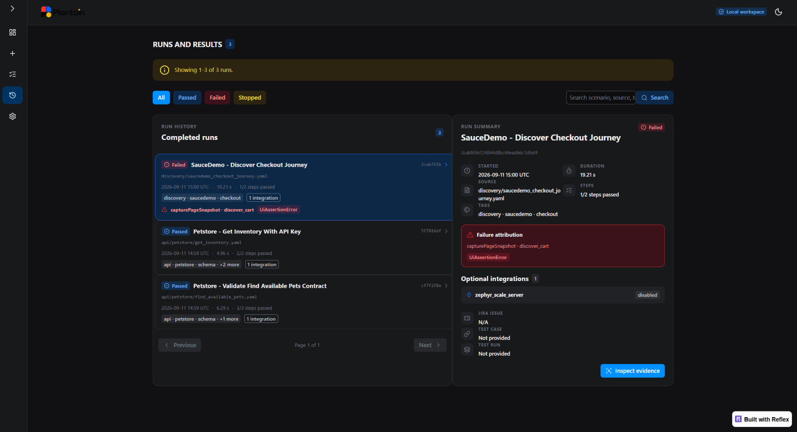
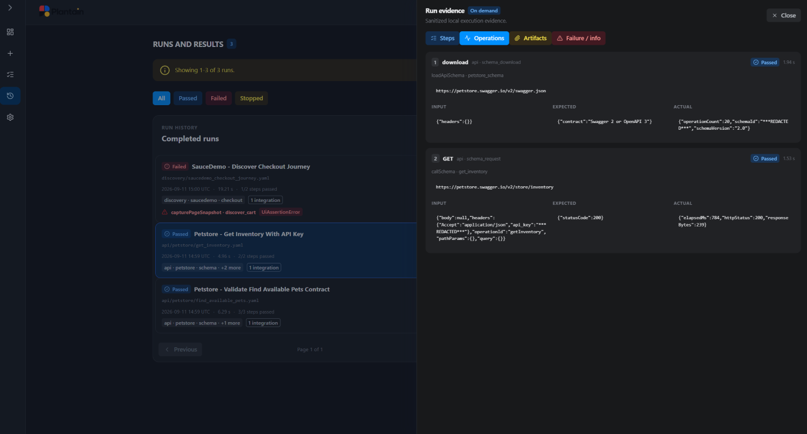

# Review runs and results

**Runs and Results** is the immutable history of local test executions. Start with
the compact list, select the result that needs attention, and open detailed
evidence only when it helps you make a decision.

*The page separates immutable history from the selected summary and explicitly
reports records excluded because they were invalid or ambiguous.*

## Find a result

Search by scenario, source, tag, or activity. Results are paginated so the page
remains useful as local history grows.

Each history entry identifies the test, status, execution time, and compact
context. Selecting an entry opens its result summary without navigating away from
the history.

## Read the result summary

The selected result includes bounded, re-redacted metadata such as:

- status;
- scenario name;
- correlation identifier;
- start time;
- duration;
- source;
- completed steps;
- tags;
- attributed failure stage when present;
- optional Jira, Zephyr test-case, and test-run references;
- optional integration publication summary.

This summary answers “what ran and what happened?” It does not load large evidence
collections automatically.

## Inspect evidence on demand

Choose **Inspect evidence** to open the right-side **Run evidence** drawer.

*Evidence is loaded on demand, bounded for browser display, and redacted again
before presentation.*

The drawer separates evidence by meaning:

### Operations

Shows the ordered actions and checks retained for the run. Where available, an
operation can include bounded sanitized input, expectation, and actual evidence.

Use this view to identify the first step whose outcome diverged from the intended
behavior.

### Artifacts

Shows safe references to artifacts retained by the run, such as supported semantic
UI evidence or reporting output.

An artifact reference is evidence associated with this immutable execution; it is
not an instruction to edit runtime files manually.

### Failure / info

Shows structured failure attribution and safe details when a run recorded them.
Passed runs may have no failure evidence.

Use the failure stage and activity identity to decide whether the next action is:

- correct an environment value;
- refresh discovery evidence;
- refine the test intent;
- request a focused repair;
- investigate the target application.

## Understand bounded display

Evidence pages are deliberately bounded and re-redacted when loaded. You may see:

- a notice that a displayed value was limited;
- pagination controls;
- a lower-bound count because the safe scan limit was reached;
- an empty category when that result recorded no evidence of that type.

Viewer limits do not change execution and do not modify the immutable local result.
They control only how much data enters the browser at once.

## Compare repeated runs

Every run has its own correlation identity and retained outcome. If you rerun a
test after a repair:

1. keep the earlier failure as evidence;
2. open the new result separately;
3. compare the failure stage, completed steps, and relevant evidence;
4. confirm that the intended behavior—not merely the symptom—now passes.

Plantain never turns a rerun into an in-place update.

## Understand integration status

Local results are authoritative. Optional integrations may receive selected,
sanitized publication data after local persistence succeeds.

An integration failure does not erase the local result. Review the integration
summary to distinguish:

- test execution failure;
- local result persistence;
- optional publication success, delay, or failure.

Configure destinations under the **Results** section of
[Settings](../configuration/integrations.md).

## Protect evidence

Results, detailed JSONL traces, semantic snapshots, and integration outbox records
can contain sensitive operational context even after sanitization. Keep `output/`
and snapshots out of Git, limit filesystem access, and share only the evidence
needed for an approved investigation.

Plantain never copies raw HTTP bodies, database credentials, or unredacted browser
errors into user-facing diagnostics.

## If a result is missing

- Refresh the history.
- Confirm the dashboard uses the intended project root.
- Check whether execution was blocked before a result could be admitted.
- Review the sanitized terminal log for a persistence failure.
- Confirm the filesystem supports Plantain’s required atomic writes.

See [Troubleshooting](../operations/troubleshooting.md) for guided recovery.
